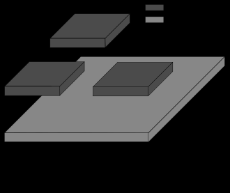

## 什么是中间件

**中间件是一种计算机软件，为软件应用程序提供操作系统以外的服务**。它可以被描述为"软件胶水"。

中间件使软件开发者更容易实现通信和输入/输出，因此他们可以专注于其应用程序的具体目的。它在20世纪80年代得到了普及，作为解决如何将较新的应用程序与较旧的遗留系统联系起来的问题，尽管这个术语从1968年就开始使用了。

### 中间件的类型

关于中间件的分类，存在许多定义，这些定义要么是关于它的使用领域，要么是关于它所服务的应用模块。在最近的书目中，中间件的主要分类如下：。

- **事务性的(Transactional)**。处理多个同步/异步交易，作为分布式系统(如银行交易或信用卡支付)的相关请求集群。
- **面向消息的(Message-oriented)**。消息队列和消息传递架构，支持同步/异步通信。
- **程序性的(Procedural)**。远程和本地架构，连接、传递和检索异步系统通信的软件响应，如调用操作。
- **面向对象(Object-oriented)**。与程序性中间件相似，然而，这种类型的中间件包含了面向对象的编程设计原则。从分析上看，其软件组件包含了对象引用、异常和通过分布式对象请求的属性继承。

## 相关文章

* [乘风破浪，遇见最佳跨平台跨终端框架.Net Core/.Net生态 - 浅析ASP.NET Core中间件，掌控请求处理过程中的关键](https://www.cnblogs.com/taylorshi/p/16774190.html)